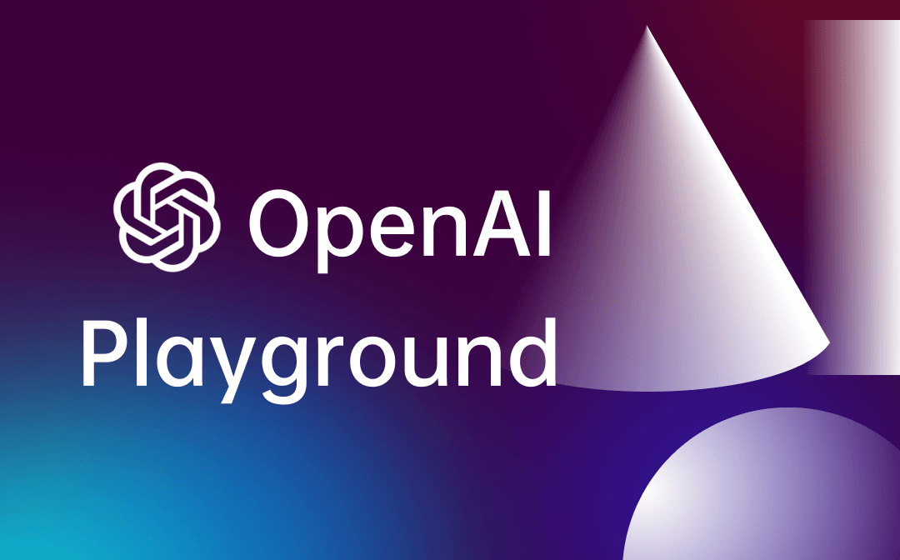

# Welcome to the OpenAI Playground Guide

The OpenAI Playground is a simple online tool that lets you experiment with AI models like GPT-3.5 and GPT-4.

Navigate to different sections:

- [Features](features.html)
- [How to Use](guide.html)
- [FAQ](faq.html)
